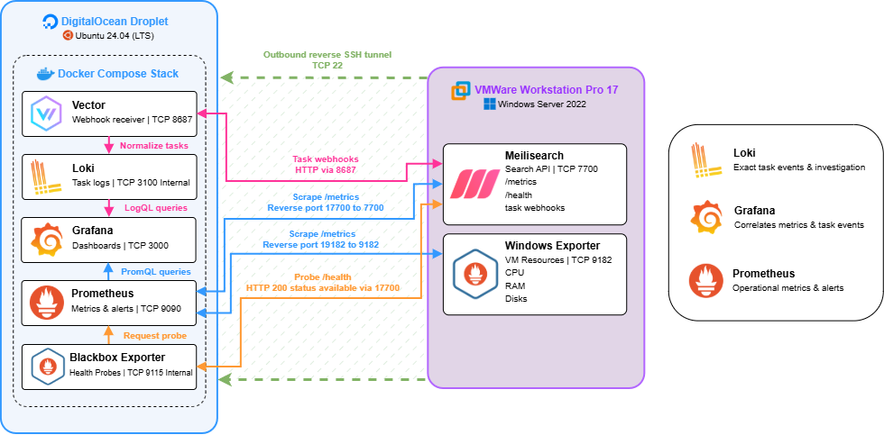

# Meilisearch Monitoring

> This exploratory project monitors Meilisearch and resource usage on the VM that self-hosts it. It is part of my other project [Convoza](https://github.com/andyathsid/convoza), a real-time chat application that uses Meilisearch for global full-text search.

The experiment intentionally keeps the monitoring stack separate from the workload it observes. A Windows Server VM in VMware Workstation Pro 17 runs Meilisearch and `windows_exporter`; an Ubuntu DigitalOcean Droplet runs the monitoring stack. The two machines could of course be replaced with other servers from any providers. Windows Server was selected to explore its telemetry, and the DigitalOcean Droplet was the accessible remote VM for this experiment.

This repository contains the monitoring-server configuration: Prometheus, Grafana, Blackbox Exporter, Loki, and Vector. It also includes a repeatable Windows-VM setup and a reverse SSH transport so the monitoring server can collect metrics without exposing Meilisearch or `windows_exporter` to the internet.

## Architecture



The Windows Server VM initiates one outbound SSH connection to the Ubuntu monitoring VM. That connection creates two listeners on the Ubuntu VM's private address:

| Ubuntu VM listener | Forwards to the Windows Server VM       | Consumer                         |
| ------------------ | --------------------------------------- | -------------------------------- |
| `17700`          | Meilisearch`127.0.0.1:7700`           | Prometheus and Blackbox Exporter |
| `19182`          | `windows_exporter` `127.0.0.1:9182` | Prometheus                       |

Prometheus stores and evaluates metrics and alert rules. Blackbox Exporter checks Meilisearch's `/health` endpoint. Grafana reads Prometheus for metrics and Loki for task-event investigation. Vector can receive Meilisearch task webhooks at `/meilisearch/tasks` and normalize them into Loki.

## What you need

- A Windows Server VM with outbound SSH access to an Ubuntu monitoring VM.
- An Ubuntu monitoring VM with public and private IP addresses, and an SSH account with `sudo` access.
- Approved, pinned releases of [Meilisearch](https://github.com/meilisearch/meilisearch/releases), [WinSW](https://github.com/winsw/winsw/releases), and [windows_exporter](https://github.com/prometheus-community/windows_exporter/releases).
- Docker Engine and Docker Compose on the Ubuntu monitoring VM. Follow the [Docker Engine installation for Ubuntu](https://docs.docker.com/engine/install/ubuntu/) for the current package steps.
- The repository copied or cloned to `/opt/meili-monitoring` on the Ubuntu monitoring VM.

Use these placeholders throughout the setup:

```text
<MONITORING_VM_PUBLIC_IP>   Public address used by Windows to initiate SSH
<MONITORING_VM_PRIVATE_IP>  Private address on which reverse listeners bind
<SSH_USER>                  Restricted SSH account on the Ubuntu monitoring VM
```

Do not reuse the sample addresses in configuration history. The Ubuntu monitoring VM's private address must be used consistently in the tunnel command and in all three Windows-target references in `prometheus/prometheus.yml`.

## 1. Prepare the Windows VM

Open an elevated PowerShell session. Create separate locations for the search engine, its data, and monitoring files:

```powershell
New-Item -ItemType Directory -Force C:\Meilisearch\data, C:\Meilisearch\logs, C:\Monitoring | Out-Null
```

Download the approved release artifacts, verify their SHA-256 checksums, then place them as follows:

```text
C:\Meilisearch\meilisearch.exe
C:\Meilisearch\MeilisearchService.exe   # renamed WinSW-x64.exe
```

Generate a strong Meilisearch master key and store it as a machine environment variable. Keep the value out of scripts, shell history, and this repository:

```powershell
$masterKey = Read-Host 'Meilisearch master key' -AsSecureString
$masterKeyPlain = [System.Net.NetworkCredential]::new('', $masterKey).Password
[Environment]::SetEnvironmentVariable('MEILI_MASTER_KEY', $masterKeyPlain, 'Machine')
$masterKeyPlain = $null
```

Create `C:\Meilisearch\MeilisearchService.xml` next to `MeilisearchService.exe`:

```xml
<service>
  <id>Meilisearch</id>
  <name>Meilisearch</name>
  <description>Meilisearch search engine</description>
  <executable>%BASE%\meilisearch.exe</executable>
  <arguments>--env production --http-addr 127.0.0.1:7700 --db-path "%BASE%\data" --experimental-enable-metrics --log-level INFO</arguments>
  <workingdirectory>%BASE%</workingdirectory>
  <startmode>Automatic</startmode>
  <stoptimeout>30 sec</stoptimeout>
  <logpath>%BASE%\logs</logpath>
  <log mode="roll-by-size-time">
    <sizeThreshold>102400</sizeThreshold>
    <pattern>yyyyMMdd</pattern>
  </log>
</service>
```

Binding to loopback is the safe default for this topology: the SSH tunnel can reach it, while the VM does not publish port `7700`. If Convoza must access Meilisearch over the network, put the service behind a properly authenticated and firewall-restricted endpoint rather than changing the monitoring tunnel.

Install the service and enable restart recovery:

```powershell
Set-Location C:\Meilisearch
.\MeilisearchService.exe install
sc.exe failure Meilisearch reset= 86400 actions= restart/60000/restart/120000/none/0
sc.exe failureflag Meilisearch 1
Start-Service Meilisearch
Invoke-RestMethod http://127.0.0.1:7700/health
```

The health response should contain `"status":"available"`.

### Create the Prometheus-only key

Meilisearch metrics require authentication when a master key is set. Create a key restricted to the `metrics.get` action, copy the returned `key` value once, and store it only on the monitoring server:

```powershell
$masterKey = [Environment]::GetEnvironmentVariable('MEILI_MASTER_KEY', 'Machine')
$headers = @{ Authorization = "Bearer $masterKey" }
$body = @{
  name = 'prometheus-monitoring'
  description = 'Read-only key for Prometheus metrics scraping'
  actions = @('metrics.get')
  indexes = @('*')
  expiresAt = '2027-01-01T00:00:00Z'
} | ConvertTo-Json

$metricsKey = Invoke-RestMethod -Method Post `
  -Uri http://127.0.0.1:7700/keys `
  -Headers $headers `
  -ContentType 'application/json' `
  -Body $body

Invoke-WebRequest http://127.0.0.1:7700/metrics `
  -Headers @{ Authorization = "Bearer $($metricsKey.key)" }
```

The request must return HTTP 200. Meilisearch describes the experimental metrics endpoint and its required permission in its [Prometheus metrics reference](https://www.meilisearch.com/docs/reference/api/stats/get-prometheus-metrics).

## 2. Install `windows_exporter`

Enable the Windows process counters before collecting the Meilisearch process:

```powershell
lodctr.exe /E:Lsa
lodctr.exe /E:PerfProc
lodctr.exe /R
typeperf.exe '\Process(meilisearch)\Working Set' -sc 2
```

Create `C:\Monitoring\windows_exporter.yml` to collect host capacity and only the process and services relevant to this experiment:

```yaml
collectors:
  enabled: cpu,logical_disk,memory,net,os,pagefile,physical_disk,process,service,system

collector:
  process:
    include: meilisearch.*
  service:
    include: (Meilisearch|windows_exporter)

log:
  level: warn
```

Install the approved MSI from an elevated PowerShell session, replacing the package path if necessary:

```powershell
$msiPath = 'C:\Install\windows_exporter.msi'
$configPath = 'C:\Monitoring\windows_exporter.yml'
Start-Process msiexec.exe -Wait -PassThru -ArgumentList @('/i', $msiPath, '/qn', "CONFIG_FILE=$configPath")

Get-Service windows_exporter
Invoke-RestMethod http://127.0.0.1:9182/health
```

The health response should contain `"status":"ok"`. Verify that `/metrics` includes the Meilisearch process and service series before continuing:

```powershell
$metrics = (Invoke-WebRequest http://127.0.0.1:9182/metrics).Content
$metrics -match 'windows_process_working_set_bytes.*meilisearch'
$metrics -match 'windows_service_state.*Meilisearch'
```

Do not create hypervisor NAT mappings or inbound Windows Firewall rules for ports `7700` or `9182`; the reverse SSH connection reaches both loopback endpoints.

## 3. Configure the reverse SSH tunnel

On the Ubuntu monitoring VM, permit remote forwarding and binding to the specified private interface:

```bash
sudo install -d -m 0755 /etc/ssh/sshd_config.d
sudo tee /etc/ssh/sshd_config.d/reverse-tunnel.conf >/dev/null <<'EOF'
GatewayPorts clientspecified
AllowTcpForwarding yes
EOF

sudo sshd -t
sudo systemctl restart ssh
```

Keep the existing SSH session open until a second login succeeds. For a production deployment, restrict `<SSH_USER>` in `authorized_keys` or `sshd_config` to the two permitted remote-forward ports.

From the Windows Server VM, prove the tunnel in a foreground PowerShell window. Confirm the Ubuntu monitoring VM host-key fingerprint before authenticating:

```powershell
ssh.exe -NT `
  -o ServerAliveInterval=30 `
  -o ServerAliveCountMax=3 `
  -o ExitOnForwardFailure=yes `
  -R <MONITORING_VM_PRIVATE_IP>:17700:127.0.0.1:7700 `
  -R <MONITORING_VM_PRIVATE_IP>:19182:127.0.0.1:9182 `
  <SSH_USER>@<MONITORING_VM_PUBLIC_IP>
```

In another Ubuntu monitoring VM session, verify that the listeners and tunneled services are available:

```bash
sudo ss -lntp | grep -E ':(17700|19182)\b'
curl --fail --show-error http://<MONITORING_VM_PRIVATE_IP>:17700/health
curl --fail --show-error http://<MONITORING_VM_PRIVATE_IP>:19182/health
```

For persistence, use a dedicated `ed25519` key, a pinned `known_hosts` file, `BatchMode=yes`, and a Windows Scheduled Task that runs as `SYSTEM` at startup. The scheduled task must retain the same two `-R` options and use `ExitOnForwardFailure=yes`; its `Running` state alone does not prove the remote listeners were created.

## 4. Set up the monitoring server

On the Ubuntu monitoring VM, install Docker and place this repository at `/opt/meili-monitoring`. Before starting containers, set exact image versions in `.env`; do not use `latest`:

```dotenv
PROMETHEUS_VERSION=<approved-version>
BLACKBOX_EXPORTER_VERSION=<approved-version>
GRAFANA_VERSION=<approved-version>
LOKI_VERSION=<approved-version>
VECTOR_VERSION=<approved-version>-alpine
```

Update each occurrence of the sample address in the Prometheus configuration. It must point at the private listeners created by the tunnel, never directly at the Windows Server VM address:

```bash
cd /opt/meili-monitoring
rg -n '10\.104\.0\.3' prometheus/prometheus.yml
# Replace every displayed value with <MONITORING_VM_PRIVATE_IP> in your editor.
```

Create the runtime secrets without adding them to version control:

```bash
install -d -m 0700 secrets

read -rsp 'Meilisearch metrics key: ' secret_value
printf '%s' "$secret_value" > secrets/meilisearch_metrics_key
unset secret_value

read -rsp 'Grafana admin password: ' secret_value
printf '%s' "$secret_value" > secrets/grafana_admin_password
unset secret_value

read -rsp 'Meilisearch task-webhook password: ' secret_value
printf '%s' "$secret_value" > secrets/meilisearch_webhook_password
unset secret_value

# These mounts are declared by Compose. The current Vector receiver is HTTP,
# so empty placeholders are sufficient until TLS termination is configured.
install -m 0400 /dev/null secrets/vector_webhook_tls.crt
install -m 0400 /dev/null secrets/vector_webhook_tls.key
chmod 0444 secrets/meilisearch_metrics_key secrets/grafana_admin_password secrets/meilisearch_webhook_password
```

Validate the configuration, then start the stack:

```bash
docker compose config -q

set -a
source .env
set +a
docker run --rm \
  --entrypoint /bin/promtool \
  -v "$PWD/prometheus:/etc/prometheus:ro" \
  -v "$PWD/secrets/meilisearch_metrics_key:/run/secrets/meilisearch_metrics_key:ro" \
  "prom/prometheus:${PROMETHEUS_VERSION}" \
  check config /etc/prometheus/prometheus.yml

docker compose pull
docker compose up -d --force-recreate
docker compose ps
```

Verify readiness and the three Windows-facing jobs:

```bash
curl --fail --show-error http://127.0.0.1:9090/-/ready

curl --silent --get \
  --data-urlencode 'query=up{job="meilisearch"}' \
  http://127.0.0.1:9090/api/v1/query
curl --silent --get \
  --data-urlencode 'query=up{job="windows"}' \
  http://127.0.0.1:9090/api/v1/query
curl --silent --get \
  --data-urlencode 'query=probe_success{job="meilisearch-health"}' \
  http://127.0.0.1:9090/api/v1/query
```

Each query should report a value of `1`. Open Grafana at `http://<MONITORING_VM_PUBLIC_IP>:3000` and Prometheus at `http://<MONITORING_VM_PUBLIC_IP>:9090` only after limiting the Ubuntu monitoring VM firewall and any network firewall to trusted operator IP ranges. Prometheus has no built-in authentication in this setup.

## Optional: collect Meilisearch task events

The included Vector receiver accepts `POST /meilisearch/tasks` on port `8687` with HTTP Basic authentication and writes normalized task records to Loki. Configure Meilisearch task webhooks to use:

```text
URL:      http://<MONITORING_VM_PUBLIC_IP>:8687/meilisearch/tasks
Username: meilisearch-webhook
Password: value in secrets/meilisearch_webhook_password
```

This direct endpoint is appropriate only for a controlled experiment. It is public HTTP, so protect it with TLS and source-IP controls, a private VPN, or a reverse proxy before using it outside a test environment. See Meilisearch's [task-webhook reference](https://www.meilisearch.com/docs/resources/self_hosting/webhooks) for the current request contract.

## Operating notes

- Reverse ports `17700` and `19182` must bind only to the Ubuntu monitoring VM's private interface; do not bind them to `0.0.0.0`.
- Rotate the least-privilege `metrics.get` key before it expires, then replace `secrets/meilisearch_metrics_key` and recreate Prometheus.
- Keep the image versions pinned and validate the Prometheus configuration and rules before an upgrade.
- Back up persistent Docker volumes and the Meilisearch data directory independently; they live on separate machines by design.
- Run `npm test` to validate the included monitoring-showcase utility. Its workload is intentionally isolated from application indexes.

## Upstream links

- [Meilisearch configuration](https://www.meilisearch.com/docs/resources/self_hosting/configuration/reference)
- [Meilisearch Prometheus metrics](https://www.meilisearch.com/docs/reference/api/stats/get-prometheus-metrics)
- [windows_exporter](https://github.com/prometheus-community/windows_exporter)
- [OpenSSH port forwarding](https://man.openbsd.org/ssh)
- [Prometheus configuration](https://prometheus.io/docs/prometheus/latest/configuration/configuration/)
- [Grafana in Docker](https://grafana.com/docs/grafana/latest/setup-grafana/installation/docker/)
